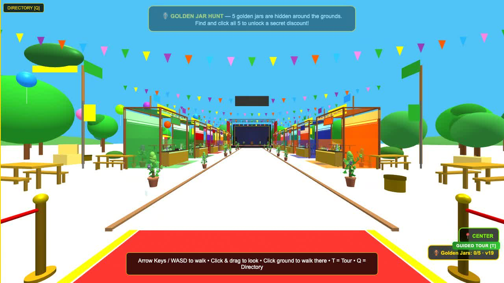

# The Farmstand 3D — Virtual Cannabis Marketplace

[](https://marijuanaunion.com/marketplace/)
[](https://aframe.io/)
[](LICENSE)

> Step inside **The Farmstand 3D** — an immersive, WebXR-powered virtual marketplace where cannabis vendors showcase products in a 3D environment you can explore from any browser.

**[Walk it live →](https://marijuanaunion.com/marketplace/)**



This repo *is* the marketplace. `index.html` here is the exact file serving at the link above — currently **build v27**.

## About the Project

A complete outdoor convention — vendor booths, a scavenger hunt, a guided tour, a blimp — running entirely in the browser. No app, no headset, no build step, no framework churn. One HTML file, [A-Frame](https://aframe.io), and vanilla JavaScript.

### What's inside

- 🏕️ **An open-air festival grounds** — procedurally built booths, pennant bunting, flag poles, trees, rolling hills, drifting balloons, and a blimp towing a banner
- 🏪 **12 real vendor booths** — click any booth for vendor info and a link to their actual shop or Instagram
- 🖼️ **Real vendor branding** — each booth carries that vendor's logo board and wall art, with per-vendor roof styles (pitched, ridged, flat, canopy, burlap awning) so no two stalls look alike
- 🏺 **Golden Jar scavenger hunt** — five jars hidden around the grounds; find them all to unlock a discount code (confetti and chiptune chime included)
- 🚶 **Walks everywhere** — WASD + mouse on desktop, a virtual joystick on phones, click-the-ground teleport, a guided tour mode, and a booth directory with fly-to
- 📐 **Fits any screen** — the whole scene rescales on resize, orientation change, and load, so phones and ultrawides both get the full grounds
- 🥽 **WebXR ready** — works in VR headsets (Quest, etc.) as well as flat-screen browsers
- 🔄 **Self-updating** — a dormant tab checks `version.txt` on wake and reloads itself once if the server shipped a newer build

## The two bugs that made mobile walking "impossible" for a month

This project shipped with a walking joystick that *never worked on iPhones* — until two real bugs were found, and both are the kind that waste weeks:

**1. The player had no camera.**
```html
<!-- broken: A-Frame silently injects a separate default camera -->
<a-entity id="player" wasd-controls look-controls></a-entity>

<!-- fixed: the player IS the camera -->
<a-entity id="player" camera wasd-controls look-controls></a-entity>
```
Without `camera` on the rig, A-Frame auto-creates an invisible default camera elsewhere. Desktop WASD "worked" (it moved the auto-camera), the joystick "worked" (it moved the player — which nothing was looking through). Every test passed except the only one that matters: the user's eyes.

**2. iOS steals touch gestures.**
A joystick built on `touchstart/touchmove` dies on iOS WebKit when the browser decides your drag is a scroll: it fires `pointercancel` and takes over. The fix is three layers:
- `touch-action: none` on **every** element of the joystick (not just the container — the icon your finger lands on counts)
- Pointer Events with `setPointerCapture` as the primary path
- A touch-event fallback that survives `pointercancel`

Bonus lesson: movement must be **time-based** (`units/second × dt`), never per-frame — at phone frame rates, per-frame movement is imperceptible and looks exactly like "broken."

## Run it

It's one HTML file plus the vendor art it hangs on the booths (`board_*.jpg`, `blimp_banner.jpg`) and a one-line `version.txt` the self-update check reads. Serve the folder any way you like:

```bash
git clone https://github.com/nicedreamzapp/the-farmstand-3d.git
cd the-farmstand-3d
python3 -m http.server 8000
# open http://localhost:8000
```

For VR, serve over HTTPS — WebXR requires it. Drop the images and it still runs; the booths just lose their logo boards.

Customize the `vendors` array near the top of the script for your own booths, links, and colors. Everything — ground, tent poles, booths, people, decorations — is built by small `build*()` functions you can edit live.

## Tech Stack

- [A-Frame](https://aframe.io/) (WebXR framework)
- Three.js (3D rendering)
- Vanilla JavaScript — no build step, no bundler
- Served as static files from MarijuanaUnion.com

## Related Properties

This project is part of the **Divine Tribe / NiceDreamz** web ecosystem:

| Property | URL | Description |
|----------|-----|-------------|
| **iNeedHemp.com** | [ineedhemp.com](https://ineedhemp.com) | Official Divine Tribe store — premium vaporizers, atomizers, and accessories |
| **NiceDreamzWholesale.com** | [nicedreamzwholesale.com](https://nicedreamzwholesale.com) | Wholesale distribution of Divine Tribe products and hemp goods |
| **TribeSeedBank.com** | [tribeseedbank.com](https://tribeseedbank.com) | Premium cannabis seed bank curated by the Divine Tribe community |
| **MarijuanaUnion.com** | [marijuanaunion.com](https://marijuanaunion.com) | Cannabis community hub — news, culture, and advocacy |
| **Disclosure Day** | [disclosureday.nicedreamzwholesale.com](https://disclosureday.nicedreamzwholesale.com) | Fan site for Spielberg's upcoming UFO film |
| **The Farmstand 3D** | [marijuanaunion.com/marketplace/](https://marijuanaunion.com/marketplace/) | Immersive 3D virtual cannabis marketplace built with A-Frame WebXR |

## Built with

[A-Frame](https://aframe.io) · vanilla JS · one long night with [Claude](https://claude.com/claude-code) as pair programmer

Made by [Nice Dreamz](https://www.youtube.com/@nicedreamzapps) in Humboldt County, California 🌲

## License

MIT — take it, reskin it, throw your own festival. See [LICENSE](LICENSE).

---

*Built with care by the [MarijuanaUnion](https://marijuanaunion.com) team, powered by [Divine Tribe](https://ineedhemp.com).*
